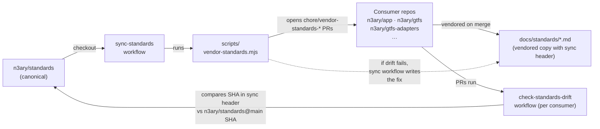

# Architecture

`n3ary/standards` is the canonical home for the n3ary org's governance rules.
Every other n3ary repo carries a copy of those rules in its own
`docs/standards/` directory. This page is the map of how those copies stay in
sync — who publishes, who consumes, and what runs end-to-end.

## Cast of repos



| Role | Repo | Owns |
| --- | --- | --- |
| Publisher (canonical) | `n3ary/standards` | `standards/*.md`, `scripts/vendor-standards.mjs`, `.github/workflows/sync-standards.yml` |
| Consumer | `n3ary/app`, `n3ary/gtfs`, `n3ary/gtfs-adapters`, and any future repo | `docs/standards/*.md` (vendored copies) + a `.github/workflows/check-standards-drift.yml` (or drift folded into `pr-validation.yml`) |

## End-to-end vendor round-trip

1. **Edit the rule** in `n3ary/standards/standards/<name>.md`. The first line
   of the file stays as the file body; sync headers are only injected when the
   file is vendored.
2. **Open a PR on `n3ary/standards`.** Review happens in this repo. The
   standards themselves are the contract — there's nothing for the drift check
   to do here yet because the publisher hasn't produced anything new.
3. **Merge the PR.** The push to `main` on `standards/**` triggers
   `.github/workflows/sync-standards.yml`.
4. **Sync workflow runs `scripts/vendor-standards.mjs`.** For each consumer in
   the `CONSUMERS` array:
   - clone the consumer's `main` at depth 1;
   - create a branch `chore/vendor-standards-<short-sha>`;
   - rewrite each `docs/standards/<file>.md` with a sync header
     (`<!-- synced from n3ary/standards@<sha> on <date> -->`) followed by the
     canonical body;
   - if any file's content actually changed, commit + push the branch + open a
     PR with the title `chore(standards): vendor from n3ary/standards@<sha>`;
   - if the consumer was already up to date with this SHA, skip silently.
5. **Each consumer's sync PR is reviewed and merged** like any other PR. There
   is no auto-merge — the branch-protection rules on every consumer require a
   PR for any commit on `main`.
6. **Consumer's `docs/standards/<file>.md` now carries the new sync header.**
   The next `check-standards-drift.yml` run on the next consumer PR sees this
   SHA and reports "up to date".

## What auto-fixes drift, and what doesn't

The drift check is **fail-loud only** — when it sees an out-of-date SHA, it
fails the consumer's PR check and asks the author to wait for the auto-sync
PR (or run the vendor script locally). It does **not** try to rewrite files
inside the consumer PR.

The auto-fix happens on the publisher side: a push to `standards/**` triggers
`sync-standards.yml`, which opens the per-consumer vendor PRs. So the feedback
loop is

```
                drift-check fails on consumer PR
                              |
                              v
author waits for / opens the next sync-standards.yml run
                              |
                              v
        vendor PR opened in consumer (auto, by publisher)
                              |
                              v
        vendor PR merged (manual review, like any PR)
                              |
                              v
              drift-check on next consumer PR passes
```

Detail in [`drift-detection.md`](./drift-detection.md).

## Auth model

The sync workflow needs to push branches and open PRs on consumer repos. The
default `GITHUB_TOKEN` is scoped to the repo running the workflow, so it can't
reach `n3ary/app` from inside `n3ary/standards`. The workflow consumes a
secret named `STANDARDS_SYNC_TOKEN` — a PAT scoped to every consumer repo with
`repo` (or fine-grained: *Contents: write* + *Pull requests: write* on each
consumer). Per-step `GH_TOKEN: ${{ secrets.STANDARDS_SYNC_TOKEN }}` makes the
`gh` CLI calls work.

Consumer drift checks are read-only — they only need the default
`GITHUB_TOKEN` with `contents: read` and a `gh api` call against
`repos/n3ary/standards/commits/main`. No PAT needed.

## Why this repo has *only* the rules and not the apps

The publisher is intentionally minimal:

- `standards/` — the 13 markdown rules.
- `scripts/vendor-standards.mjs` — the only script that ever touches a
  consumer's `docs/standards/`.
- `.github/workflows/sync-standards.yml` — the only workflow that fans out to
  consumers.

Anything that needs to run *inside* a consumer (drift check, ignore paths,
build, deploy) lives in the consumer. That separation keeps the publisher
read-only from the consumer side: it can write to `docs/standards/`, but
nothing else.

## Related

- [`sync-workflow.md`](./sync-workflow.md) — job-by-job of the publisher.
- [`drift-detection.md`](./drift-detection.md) — how the consumer's check works.
- [`consumer-integration.md`](./consumer-integration.md) — how to add a new repo to the `CONSUMERS` array.
